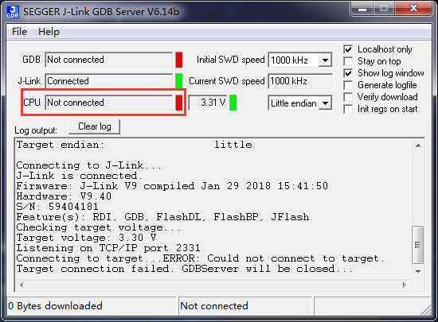

GDB Server 连接不上 CPU
======================================

关键字
-------

- CPU Not connected
- Connecting to target...ERROR: Could not connect to target.
- Target connection failed. GDBServer will be closed...

问题描述
---------

J-Link CPU 连接不上。

分析诊断
---------
1.J-Link连线不正确；

2.板子上的看门狗未短接；

3.flash里有程序正在运行；

4.IO上有外部灌电流，导致无法连接GDB Server。

解决办法
---------

1.首先检查J-Link连线是否正确，电源线、TMS、TCK、GND等；

2.其次把板子的WDG短接，并配置为调试模式；

3.再次flash里如果有程序，配置启动模式，禁止程序从flash启动；

4.最后如果有其他供电设备，先连接电源线，再连接串口，J-Link等其他供电设备。因为板子自身的电源没有问题，也就是说在板子芯片正常上电后，再出现灌电流是没问题的。

