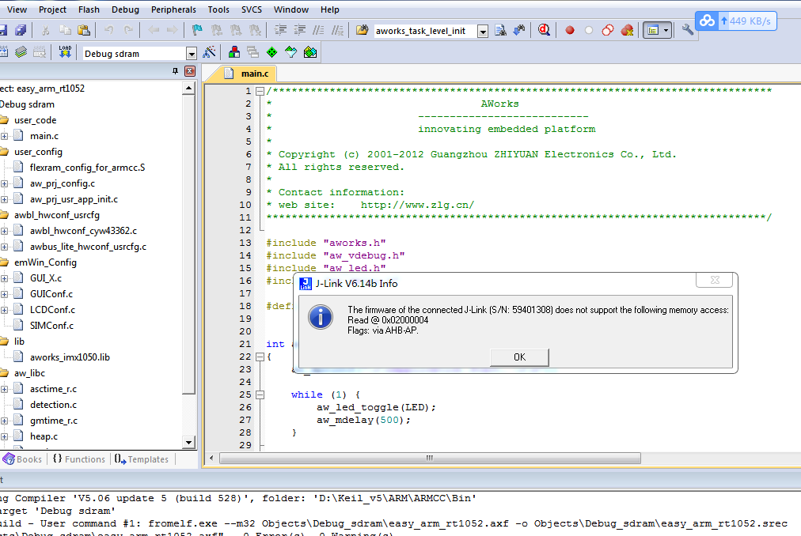

Keil 编译出错(J-Link V6.14b Info)
======================================

关键字
-------

- The firmware of the connected-J-Link(S/N:59401308) does not support the following memory access:
- Read @0x02000004
- Flags:via AHB-AP

问题描述
---------

无法进入调试，弹出错误窗口"J-Link V6.14b Info"。

分析诊断
---------
Keil版本问题，keil5.24的JL2CM3.dll 文件有问题，用Keil5.17版本可以下载程序。

解决办法
---------

1.用Keil5.17版本的JL2CM3.dll替换keil5.24。

