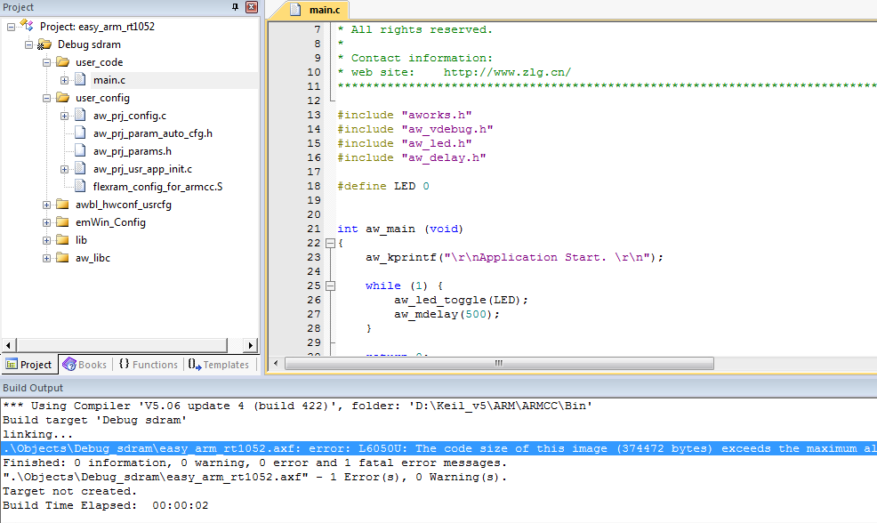

Keil 编译出错(固件过大)
======================================

关键字
-------

- The code size of this image(xxxx bytes)exceeds the maximum
- xxxx.axf -1 Error(s),0 Warning(s)

问题描述
---------

代码大小超过最大限制。

分析诊断
---------

Keil软件的licence不支持这么大的固件编译。

解决办法
---------

1.自行更新keil licence至可支持大固件编译的版本。

2.使用eclipse开发环境
