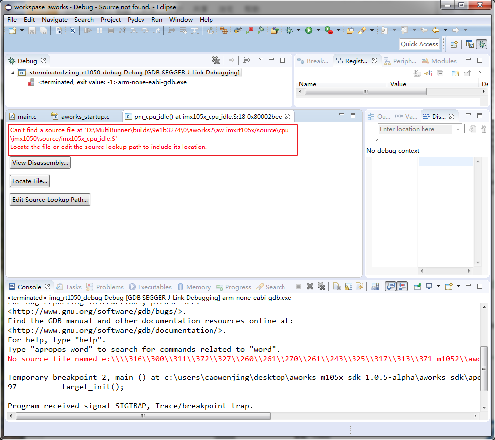

eclipse (Can't find a source file)
======================================

关键字
-------

- Can't find a source file at "xxx\xxx\xxx"
- Locate the file or edit the source lookup path to include its location
- No source file named "xxx\xxx\xxx"
- No such file or directory

问题描述
---------

无法载入Aworks源码文件

分析诊断
---------
因为sdk工程中是Aworks函数库，未能成功显示源码文件。

解决办法
---------

1. 无需解决，属于正常现象。
