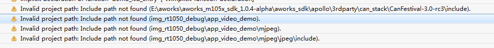
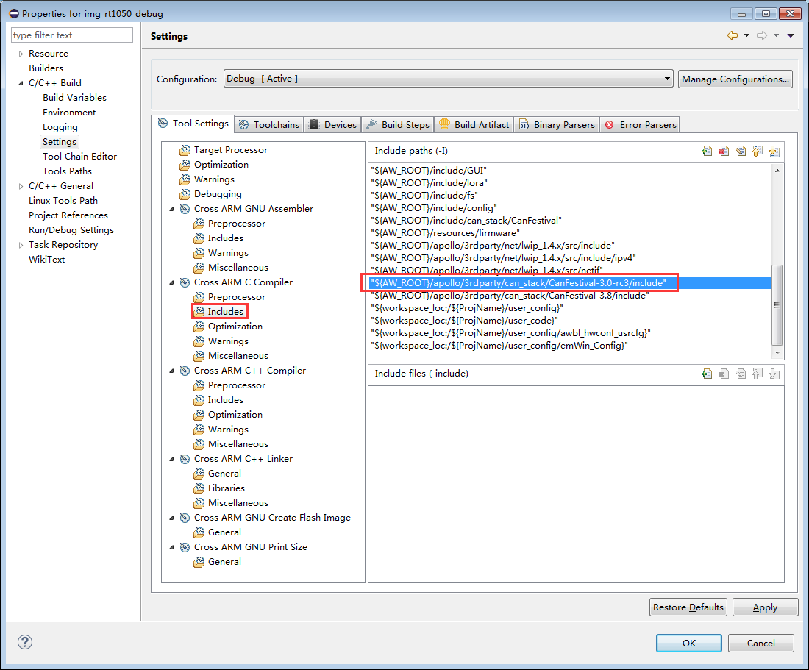
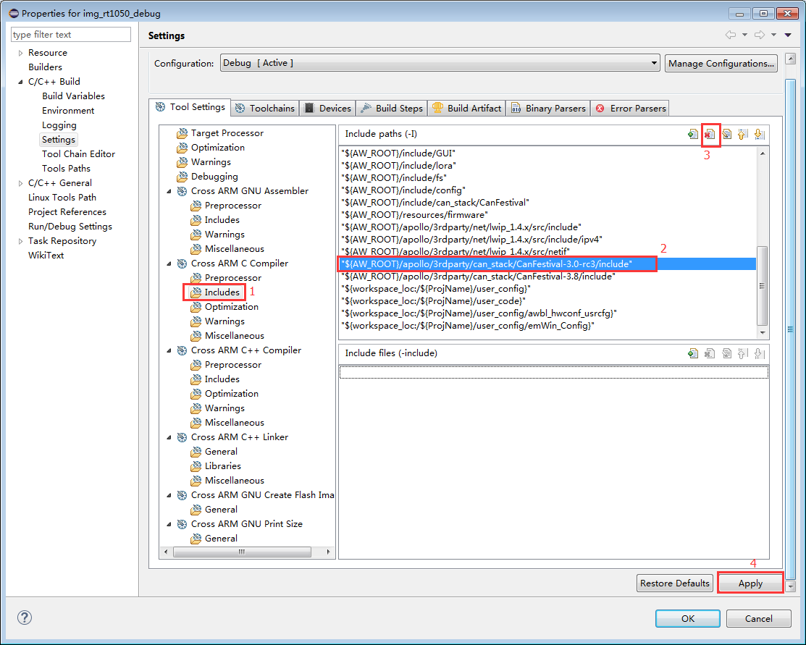
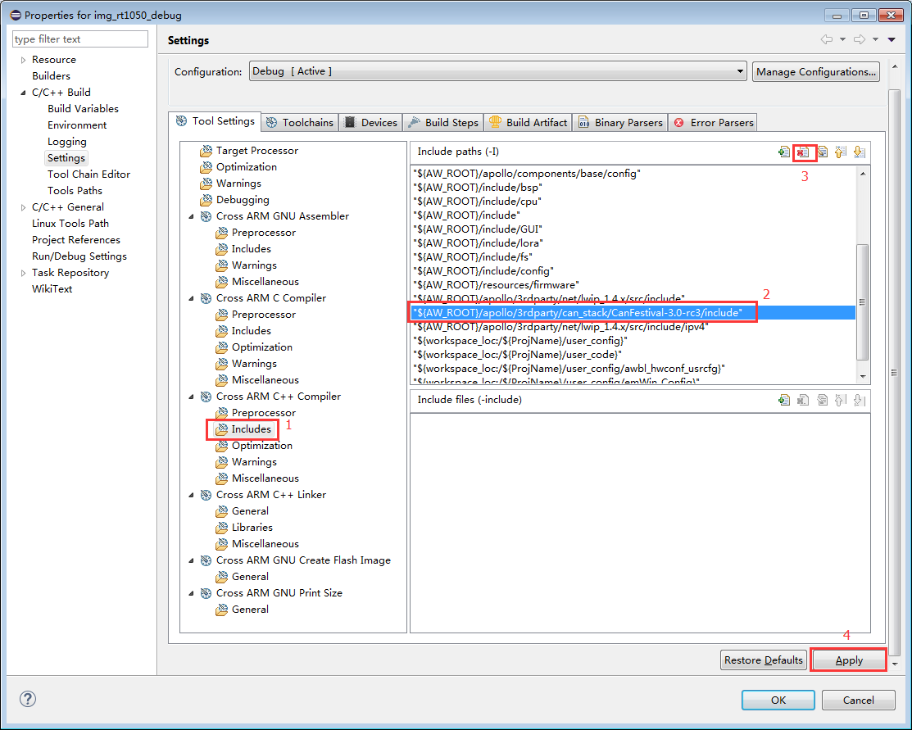
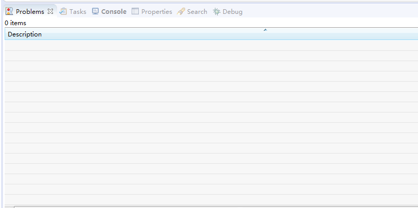

eclipse (Invalid project path)
==============================

关键字
-------

- Invalid project path: Include path not found...
- Problems
- Warnings

问题描述
---------

使用eclipse环境编译工程，在Problems窗口下出现警告：Invalid project path: Include path not found...

.. _a_pic_invaild_project_path:

   警告信息

分析诊断
---------
在工程配置中存在无效的工程路径，如 :numref:`a_pic_invaild_project_path` 所示， **"E:\\aworks\\aworks_m105x_sdk_1.0.4-alpha\\aworks_sdk\\apollo\\3rdparty\\can_stack\\CanFestival-3.0-rc3\\include"** 路径无效，说明在 **aworks_sdk** 目录下，没有 **"\\apollo\\3rdparty\\can_stack\\CanFestival-3.0-rc3\\include"**  文件夹，而用户却在工程配置中使用了该路径，如 :numref:`a_pic_project_config` 。

.. _a_pic_project_config:

   工程配置路径无效

解决办法
---------
删除工程中配置的无效路径。依次点击Project -> Properties -> C/C++ Build -> Settings，按照 :numref:`a_pic_project_config_c_delete` 和 :numref:`a_pic_project_config_cjj_delete` 删除无效路径。

.. _a_pic_project_config_c_delete:

   删除ARM C编译器中的无效路径

.. _a_pic_project_config_cjj_delete:

   删除ARM C++编译器中的无效路径

删除完成之后，再次编译工程，警告消除。

.. _a_pic_project_warning_clear_up:
