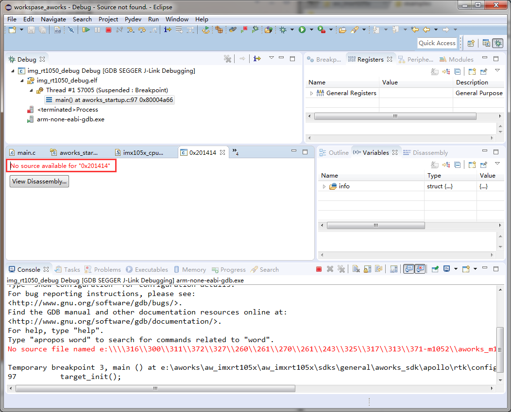
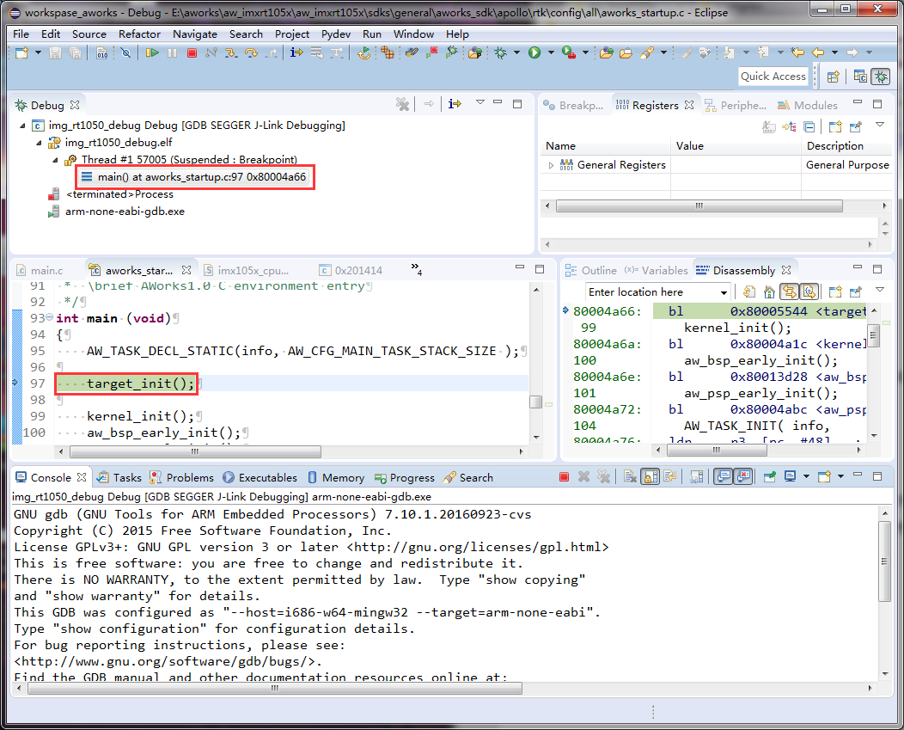
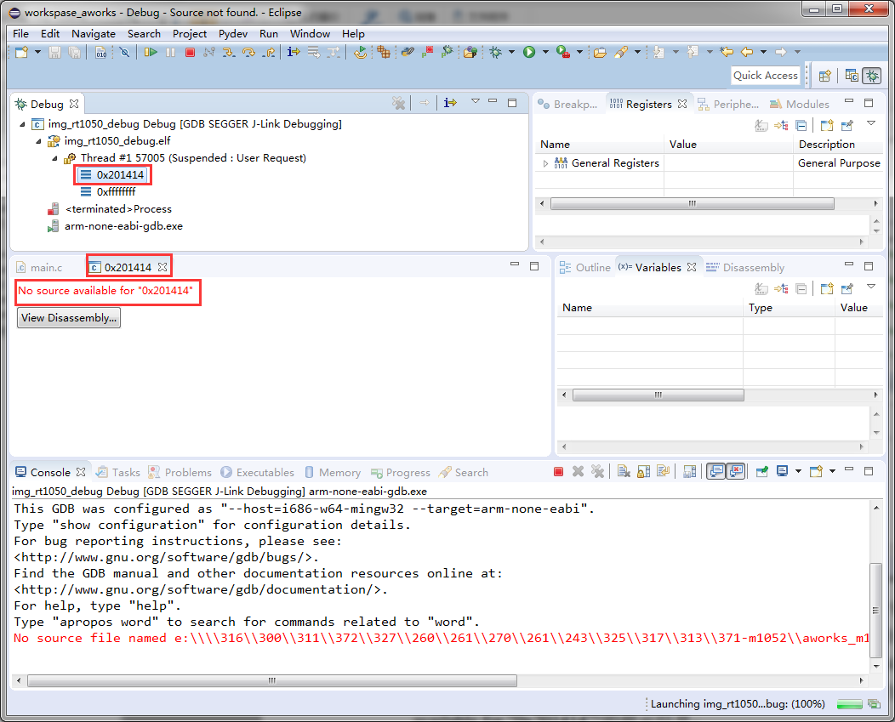

eclipse(No source available for "0xxxxx")
==========================================

关键字
-------

- No source available for "0xxxxx" 
- View Disassembly...

问题描述
---------

在eclipse开发环境下，调试下载程序时，跳出一个界面，显示不能访问寄存器某段地址。

分析诊断
---------

eclipse的调试窗口【Debug】显示当前程序的堆栈信息，当PC指针指向某个地址时，eclipse将通过J-Link监测到的数据显示该地址中指令对应的代码。如下图，0x80004a66寄存器地址中的指令信息对应的是main()函数中的代码。

   
在芯片内部ram中有一段原厂的启动程序，用来接收用户程序，当使用J-Link在eclipse调试下载程序时，首先启动原厂程序，PC指针指向原厂程序指令地址，J-Link监测到原厂程序在活动，eclipse的【Debug】窗口显示当前PC指针在0x201414，并想要去显示该地址中指令对应的代码信息，但是我们提供的工程中并没有原厂程序的代码，所以会出现 No source available for "0x201414" 的提示信息，如下图。

解决办法
---------

1. 无需解决，属于正常现象。
