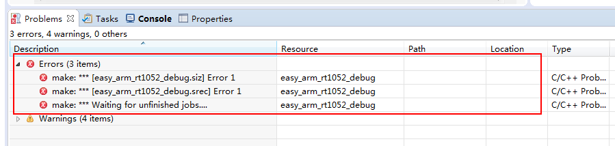
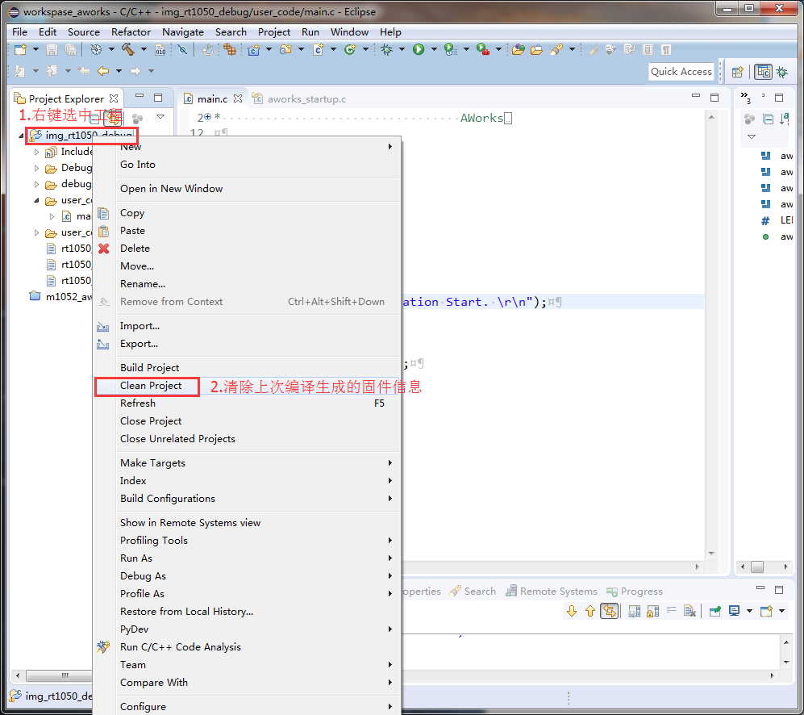
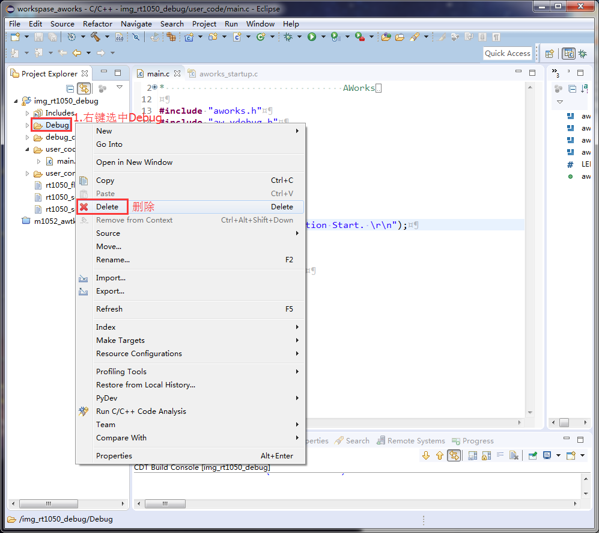

eclipse 编译出错(Clean Project)
======================================

关键字
-------

- make: ***[xxx_debug.siz] Error 1
- make: ***[xxx_debug.srec] Error 1
- make: *** Waiting for unfinished jobs... 

问题描述
---------

在程序没有错误的前提下，eclipse 依然编译出错。

分析诊断
---------

可能由eclipse的上一次编译错误造成。

解决办法
---------

1. 点击Clean Project，清除上次编译生成的固件信息，然后再次编译。

   
2. 删除Debug文件夹，重新编译固件。

