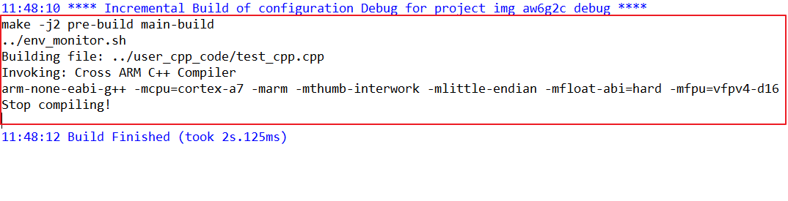

eclipse 编译出错(Cross ARM C++ Compiler)
=========================================

关键字
-------

- make -j2 pre-build main-build
- Invoking: Cross ARM C++ Compiler
- arm-none-eabi-g++ -mcpu=cortex-a7 -marm -mthumb-interwork -mlittle-endian -mfload-abi=ard -mfpu=vfpv4-d16 Stop compiling

问题描述
---------

交叉编译工具出错。

分析诊断
---------

arm-none-eabi-gcc工具路径或是版本有问题。

解决办法
---------

1. 使用光盘资料中提供的eclipse开发环境包，不要随意改动。
