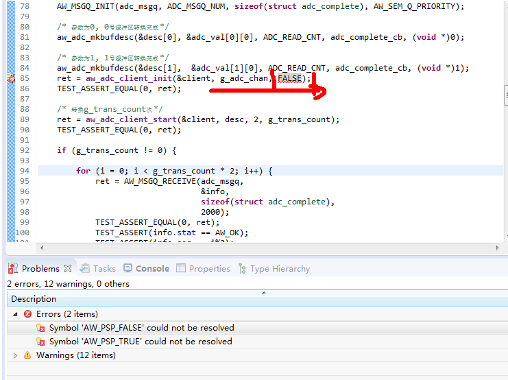
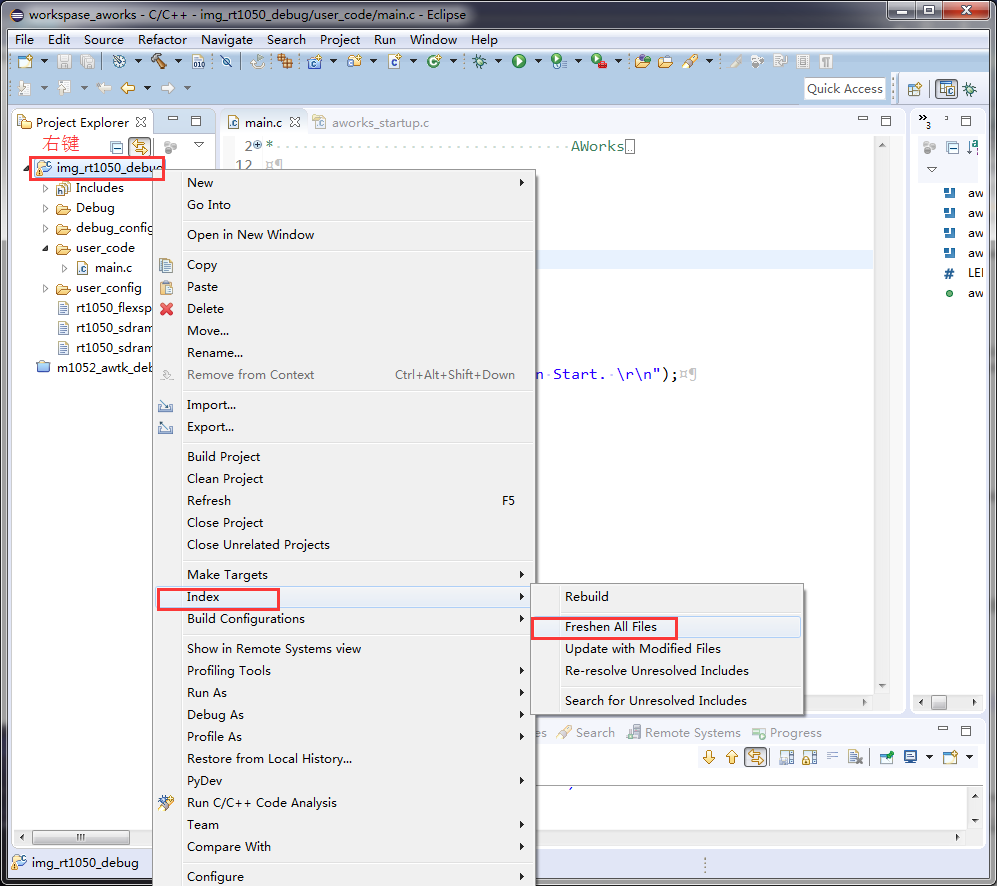

eclipse 编译出错(刷新工程)
======================================

关键字
-------

- Symbol 'AW_PSP_FALSE' counld not be resolved
- Symbol 'AW_PSP_TRUE' counld not be resolved

问题描述
---------

识别不了宏定义。

分析诊断
---------

可能是由于路径层叠太深。

解决办法
---------

1. 刷新工程中的全部文件。

