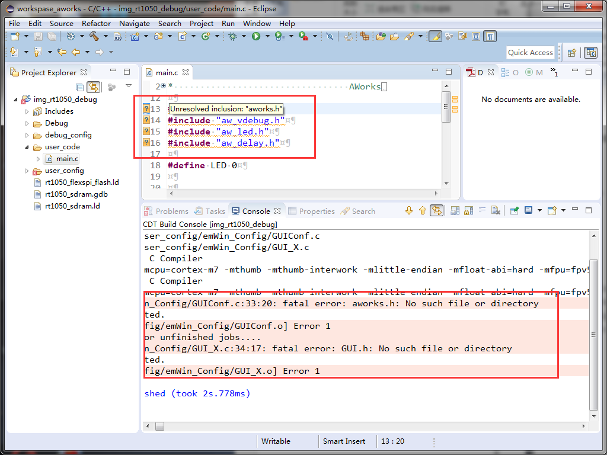
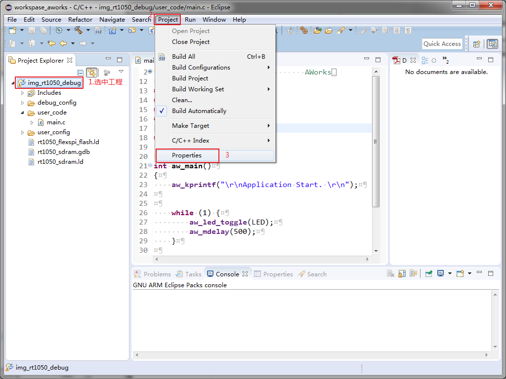
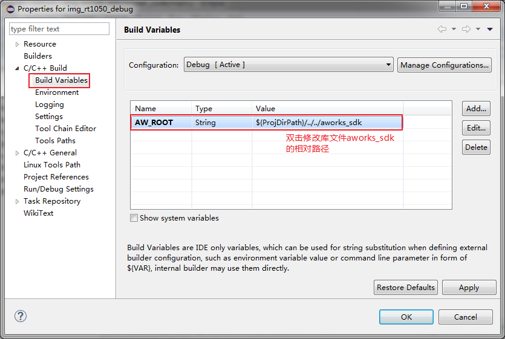

eclipse 编译出错(找不到库文件)
======================================

关键字
-------

- Unresolved inclusion: "aworks.h"
- Unresolved inclusion: "aw_vdebug.h"
- fatal error: aworks.h: No such file or directory
- fatal error: GUI.h: No such file or directory

问题描述
---------

Aworks 头文件路径都找不到。

分析诊断
---------

可能是aworks_sdk文件夹和工程目录的相对路径不正确。

解决办法
---------

1. aworks_sdk文件夹和工程文件夹的相对路径按照默认放置，不要随意改动。

2. 修改工程中配置的aworks_sdk库文件夹的相对路径。首先选中工程，依次点击 **【Project】** -> **【Properties】** -> **【C/C++ Build】** -> **【Build Variables】** 选项，在 **【Build Variables】** 选项窗口中修改 **aworks_sdk** 文件夹的相对路径。

   

