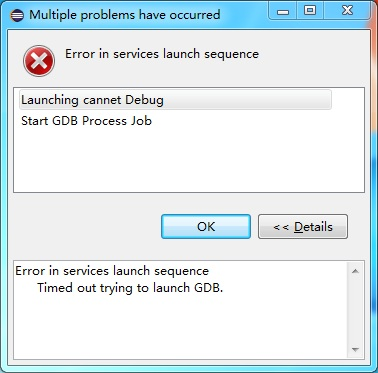
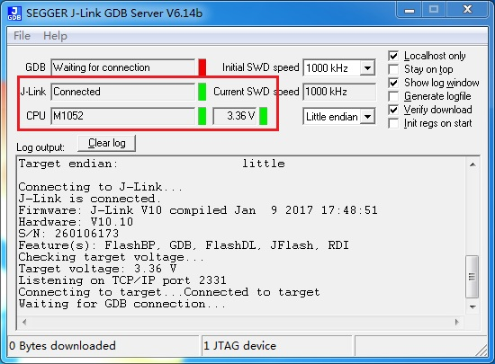

eclipse 调试失败(Multiple problems have occurred)
====================================================

关键字
--------

- Error in services launch sequence
- Launching xxx Debug
- Start GDB Process Job
- Timed out trying to launch GDB

问题描述
--------

无法进入调试，弹出错误窗口，提示启动GDB超时。

分析诊断
--------
GDB server 异常，eclipse无法找到GDB服务，多数为GDB server异常，偶尔为ecplise程序出现来错误引起。

解决办法
--------

1. 检查GDB是否已启动；
2. 确认GDB能够连接目标设备；
3. 重启GDB server和eclipse软件（eclipse与GDB已经启动）。

