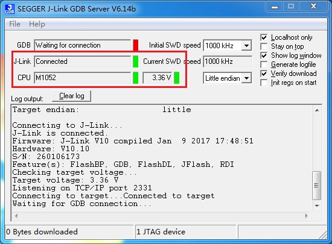

eclipse 调试失败(Problem Occurred-1)
======================================

关键字
-------

- Problem Occurred
- Launching xxx has encountered a problem
- Failed to execute MI command
- Error in final launch sequence
- Error message from debugger back end

问题描述
---------

无法进入调试，弹出错误窗口，详细信息呈现乱码现象。

分析诊断
---------
GDB server 异常，eclipse无法找到GDB服务，多数为GDB server异常（未启动），偶尔为ecplise程序出现来错误引起。

解决办法
---------

1. 检查GDB是否已启动；
2. 确认GDB能够连接目标设备；
3. 重启GDB server和eclipse软件（eclipse与GDB已经启动）。

