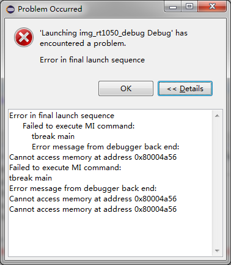
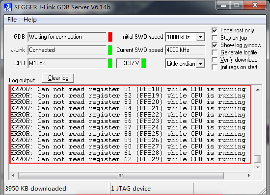

eclipse 调试失败(Problem Occurred-2)
======================================

关键字
-------

- Problem Occurred
- Launching xxx has encountered a problem
- Failed to execute MI command
- Error message from debugger back end:
- Cannot access memory at address 0x80004a56
- ERROR: Can not read register 57 (FPS24) while CPU is running

问题描述
---------

无法进入调试，弹出错误窗口，详细信息为不能访问某个内存地址，并且GDB Server显示不能访问某段寄存器。

   
分析诊断
---------
没有屏蔽看门狗，板子一直在复位，导致调试下载失败。

解决办法
---------

1. 短接看门狗，并配置启动模式。
