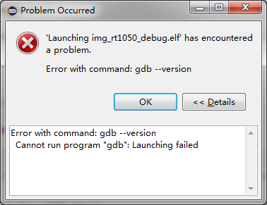
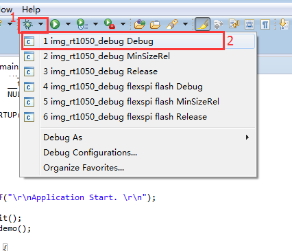

eclipse 调试失败(gdb --version)
======================================

关键字
-------

- Problem Occurred
- Launching xxx has encountered a problem
- Error with command: gdb --version
- Cannot run program "gbd":Launching failed

问题描述
---------

无法进入调试，弹出错误窗口，详细信息呈现gdb --version错误信息。

分析诊断
---------

用户所用的调试选项没有GDB初始化脚本，就直接把elf文件下载进去，所以出错了。

解决办法
---------

1.如果是模板工程，应该是用户直接点击了调试按钮，没有选择我们工程中配置好的调试选项。所以在调试时要点击调试窗口的下拉菜单，选择工程中我们配置好的调试选项。

2.如果是用户自己新建工程，可能是自己创建的调试选项没有配置好，参照《eclispe 快速入门手册》配置调试选项。

